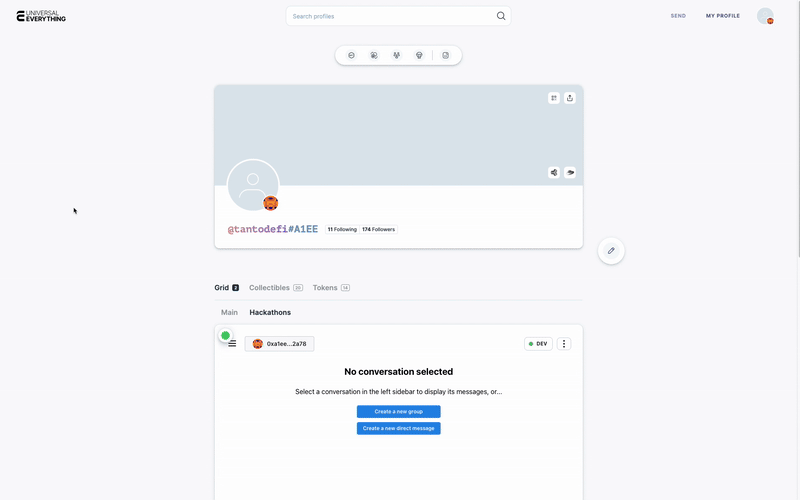

# xmtp.up app

v1 https://xmtp-chat-up.vercel.app/

v2 https://xmtp-chat-up-tantodefis-projects.vercel.app/

## Decentralized Identity & Messaging for LUKSO and XMTP

**xmtp.up** is a next-generation dApp that brings together [XMTP](https://xmtp.org/) and [LUKSO Universal Profiles](https://docs.lukso.tech/essentials/universal-profile/) to enable truly decentralized, cross-platform messaging and identity. By combining XMTP's secure, open messaging protocol with LUKSO's Universal Profile standard, users gain full ownership of their communications and on-chain identity—no centralized gatekeepers, no walled gardens.

> **Learn more about decentralized identity and XMTP:** [https://xmtp.org/identity](https://xmtp.org/identity)

---

## Features

- **LUKSO Universal Profile Support**: Connect with your UP wallet and message using your on-chain identity.
- **Grid Mini-App Compatibility**: Seamlessly operate as a mini-app within Universal Profile grids—`contextAccounts[0]` is the visitor, `contextAccounts[1]` is the grid owner.
- **ENS Lookup**: Send messages using Ethereum Name Service (ENS) names for easy addressing.
- **XMTP Messaging**: End-to-end encrypted, decentralized messaging using the XMTP protocol.
- **Profile Avatars & Names**: Fetch and display LUKSO or ENS profile data, including avatars and display names.
- **WalletConnect, MetaMask, Coinbase, and Universal Profile Extension Support**: Flexible wallet connection options.
- **Dynamic Context Awareness**: Detects if loaded as a grid mini-app or standalone, and adapts UI accordingly.
- **Feedback & Issue Reporting**: Built-in links to provide feedback and report issues.

---

## Message Grid Owner

## Basic messaging

## AI agents 
hey elsa on BASE network

possibke to integrate more LUKSO specific ai agents with XMTP:  https://github.com/ephemeraHQ/xmtp-agent-examples

## What's next?

Project currently uses a proxy ephemereal signer - would like to get the SCW signer working 

it's possible to iniate transactions from xmtp chats with the https://github.com/ephemeraHQ/xmtp-agent-examples/tree/main/examples/xmtp-transaction-content-type

Fix current known bugs regarding xmtp metadata upload and profile data erasure 

## Getting Started

The app is built using the [XMTP client browser SDK](/sdks/browser-sdk/README.md), [React](https://react.dev/), and [RainbowKit](https://www.rainbowkit.com/). It is ready for both LUKSO and Ethereum environments.

- To keep up with the latest React app developments, see the [Issues tab](https://github.com/xmtp/xmtp-js/issues) in this repo.
- To learn more about XMTP and get answers to frequently asked questions, see the [XMTP documentation](https://xmtp.org/docs).

## Useful commands

- `yarn clean`: Removes `node_modules` and `.turbo` folders
- `yarn dev`: Runs the app in development mode
- `yarn typecheck`: Runs `tsc`

---

## Limitations

This React app isn't a complete solution. For example, the list of conversations doesn't update when new messages arrive in existing conversations.

---

## Contributing

We welcome contributions and feedback! Please open an issue or submit a pull request if you'd like to help improve the app.

# XMTP TypeScript

This is the official repository for XMTP client SDKs, content types, and packages, written in TypeScript and powered by [Turborepo](https://turbo.build/repo).

To learn more about the contents of this repository, see this README and the READMEs provided in each workspace directory.

## What's inside?

### SDKs

- [`node-sdk`](https://github.com/xmtp/xmtp-js/blob/main/sdks/node-sdk): XMTP client SDK for Node (V3 only)
- [`browser-sdk`](https://github.com/xmtp/xmtp-js/blob/main/sdks/browser-sdk): XMTP client SDK for browsers (V3 only)

### Content types

- [`content-type-primitives`](content-types/content-type-primitives): Primitives for building custom XMTP content types
- [`content-type-reaction`](content-types/content-type-reaction): Content type for reactions to messages
- [`content-type-read-receipt`](content-types/content-type-read-receipt): Content type for read receipts for messages
- [`content-type-remote-attachment`](content-types/content-type-remote-attachment): Content type for sending file attachments that are stored off-network
- [`content-type-reply`](content-types/content-type-reply): Content type for direct replies to messages
- [`content-type-text`](content-types/content-type-text): Content type for plain text messages
- [`content-type-transaction-reference`](content-types/content-type-transaction-reference): Content type for on-chain transaction references

## Contributing

See our [contribution guide](./CONTRIBUTING.md) to learn more about contributing to this project.
